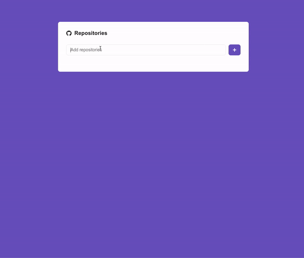

<p align="center">
    
</p>

<h1 align="center">
  🔍 Github Explorer
</h1>

<p align="center">


</p>

<p align="center">
  <a href="#computer-about-the-project">About the Project</a>&nbsp;&nbsp;&nbsp;|&nbsp;&nbsp;&nbsp;
  <a href="#hammer-technologies">Technologies</a>&nbsp;&nbsp;&nbsp;|&nbsp;&nbsp;&nbsp;
  <a href="#rocket-getting-started">Getting Started</a>&nbsp;&nbsp;&nbsp;|&nbsp;&nbsp;&nbsp;
  <a href="#mailbox-contacts">Contacts</a>&nbsp;&nbsp;&nbsp;|&nbsp;&nbsp;&nbsp;
  <a href="#memo-license">License</a>&nbsp;&nbsp;&nbsp;
</p>

<br>

<p align="center">
  
</p>

<br>

## :computer: About the Project

A search engine for repositories, based on the Github API.

## :hammer: Technologies

This project was built with:

-  [Javascript](https://developer.mozilla.org/pt-BR/docs/Web/JavaScript)
-  [ESLint](https://eslint.org/)
-  [Prettier](https://prettier.io/)
-  [EditorConfig](https://editorconfig.org/)
-  [styled-components](https://styled-components.com/)
-  [ReactJS](https://reactjs.org/)
-  [Axios](https://www.npmjs.com/package/axios)
-  [VS Code](https://code.visualstudio.com/)


## :rocket: Getting Started

**Clone or Download the Repository**

```bash
$ git clone https://github.com/Johnny-Saraiva/git-explorer-js.git

# Open the folder
$ cd git-explorer-js

```

**Installing Dependencies**

```bash
# if you use yarn, run this:

$ yarn
```
or
```bash
# if you use npm, run this:

$ npm install
```

### To start the project:

```bash

$ yarn start

```

## :mailbox: Contacts

Connect with me on [LinkedIn](https://www.linkedin.com/in/johnny-saraiva-701641164/).

## :memo: License

This project is under the MIT license. See the [LICENSE](LICENSE.md) for more information..

---

Made with ❤️ by Johnny Saraiva 👋 [Get in touch!](https://www.linkedin.com/in/johnny-saraiva-701641164/)
